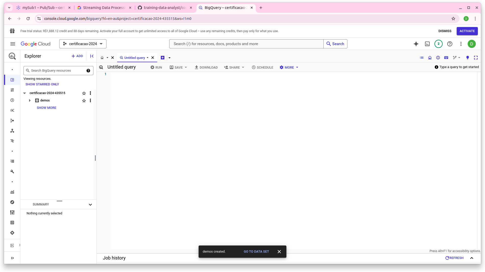
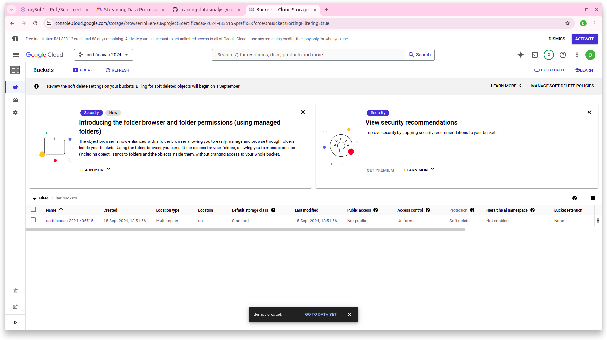
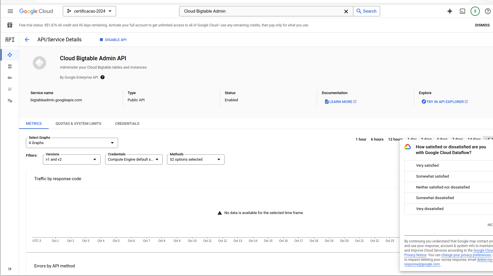

# NOTE

*Creating services on google cloud to use on project. this steps need to be don only one time*<br><br><br>

---
### Pub/Sub

- Create topic

```Bash
    gcloud pubsub topics create $TOPIC_ID
```

- Create a subscription for the topic

```Bash
    gcloud pubsub subscriptions create --topic $TOPIC_ID mySub1
```

- Publish another message

```Bash
    gcloud pubsub topics publish $TOPIC_ID --message "hello again"
```

- Pull the first message that was published to your topic

```Bash
    gcloud pubsub subscriptions pull --auto-ack mySub1    
```

### Output 

```                                               
│     DATA    │    MESSAGE_ID    │ ATTRIBUTES │
|-------------|------------------|------------┤
│ hello again │ 8914536694282991 │            │
|             |                  |            |
```

### criação de bucket e dataset





### Bigtable API Activate

